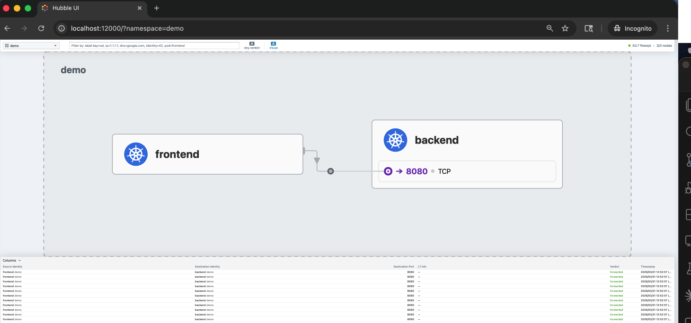
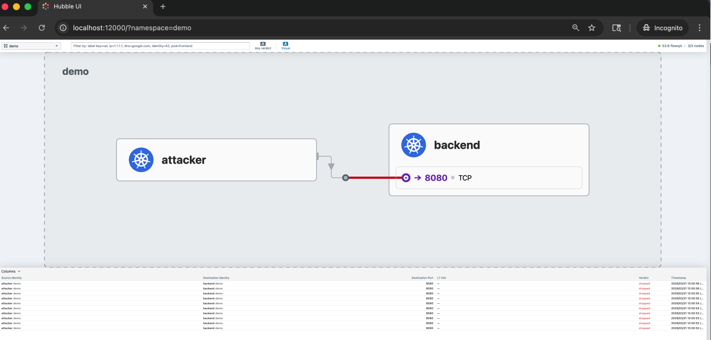
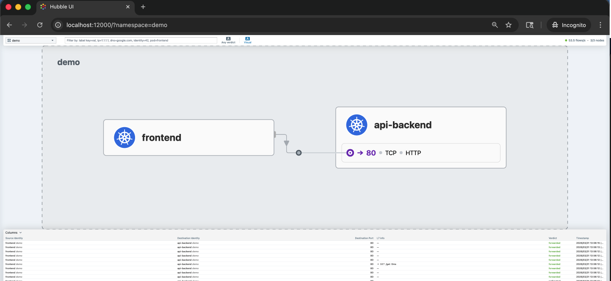
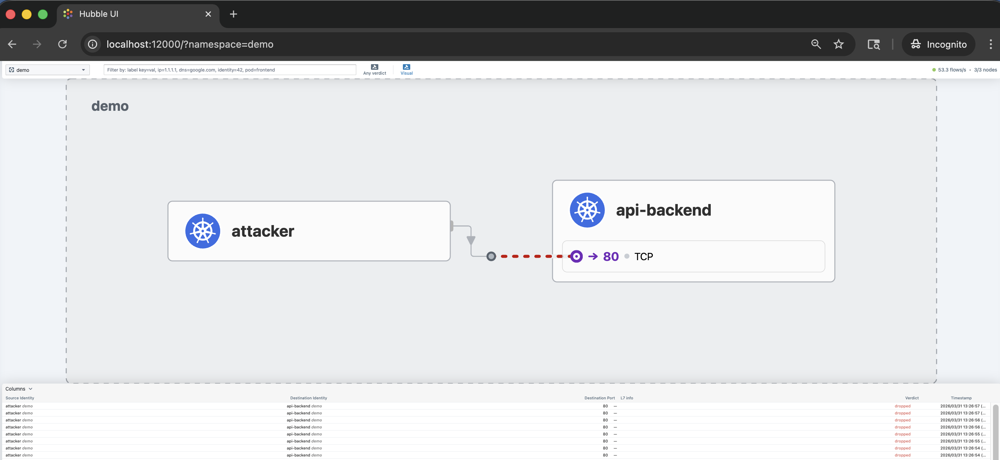

# Cilium Demo Repository

This repository gives you a simple, repeatable way to demo Cilium on a local Kubernetes cluster and then share the setup through GitHub.

The demo covers:

- Cilium installation on a local `kind` cluster
- Traffic visibility with Hubble
- L3/L4 network policy enforcement between workloads
- L7 HTTP-aware policy enforcement by method and path
- Egress policy control — restrict what a pod can reach on the outbound side
- FQDN policy — allow or deny external traffic by domain name
- ClusterMesh global service load balancing across two clusters

## Demo Story

**L3/L4 and L7 ingress policy:**

- `frontend` pod: the allowed client — can call `backend` and `api-backend`
- `attacker` pod: the unauthorized workload — blocked by ingress policy
- `backend` service: tiny HTTP echo on port `8080`
- `api-backend` service: HTTP test endpoint used for L7 method/path demos

**Egress policy:**

- `open-backend` service: no ingress policy applied — any pod in the namespace can reach it
- `attacker` pod: no egress restriction, freely reaches `open-backend`
- `egress-client` pod: has an egress policy allowing only DNS — all other outbound connections are dropped at the source

**FQDN policy:**

- `external-client` pod: FQDN egress policy applied — can reach `httpbin.org` only, all other external destinations are blocked

## Repo Layout

```
kind-config.yaml                    local single-cluster definition
manifests/
  namespace.yaml                    demo namespace
  demo-app.yaml                     all application workloads
  backend-ingress-policy.yaml       L3/L4 ingress policy for backend
  api-http-policy.yaml              L7 HTTP method and path policy for api-backend
  egress-policy.yaml                egress policy for egress-client
  fqdn-policy.yaml                  FQDN egress policy for external-client
  clustermesh/                      multi-cluster manifests
scripts/
  setup.sh                          create cluster, install Cilium, deploy core workloads
  run-demo.sh                       interactive step-by-step demo for core scenarios
  validate.sh                       verify core policy scenarios
  cleanup.sh                        delete the cluster
  setup-clustermesh.sh              create both clusters and establish ClusterMesh
  validate-clustermesh.sh           verify cross-cluster load balancing
  cleanup-clustermesh.sh            delete both clusters
docs/screenshots/                   Hubble UI screenshots
```

## Prerequisites

Install these tools on your machine before starting:

- `docker`
- `kubectl`
- `kind`
- `cilium` CLI

Official docs:

- Cilium CLI: https://docs.cilium.io/en/latest/cmdref/cilium/
- Cilium on kind: https://docs.cilium.io/en/stable/installation/kind/
- Hubble UI: https://docs.cilium.io/en/latest/cmdref/cilium_hubble_ui/

---

## Demo 1 — Cluster Setup and Cilium Installation

### Step 1 — create the cluster and install Cilium

Run the setup script. It creates the `kind` cluster, installs Cilium, enables Hubble, and deploys the core workloads.

```bash
./scripts/setup.sh
```

### Step 2 — verify Cilium is healthy

```bash
cilium status --wait
```

All components should report `OK`. Wait until the command exits cleanly before continuing.

### Step 3 — check all system pods are running

```bash
kubectl get pods -A
```

You should see Cilium agent pods (`cilium-*`) and Hubble pods running in `kube-system`.

### Step 4 — check the demo namespace

```bash
kubectl -n demo get pods,svc
```

All pods should be in `Running` state. You should see `backend`, `frontend`, `api-backend`, and `attacker` pods plus their services.

---

## Demo 2 — L3/L4 Ingress Policy

This demo shows that Cilium can enforce which source identity is allowed to reach a service. Only pods with label `app=frontend` can reach `backend` on port 8080. The `attacker` pod is silently dropped.

### Step 1 — apply the ingress policy

The policy is already applied by `setup.sh`. To apply it manually at any time:

```bash
kubectl apply -f manifests/backend-ingress-policy.yaml
```

### Step 2 — inspect the policy

```bash
kubectl -n demo get ciliumnetworkpolicy
```

```bash
kubectl -n demo describe ciliumnetworkpolicy backend-ingress-policy
```

The policy YAML:

```yaml
apiVersion: cilium.io/v2
kind: CiliumNetworkPolicy
metadata:
  name: backend-ingress-policy
  namespace: demo
spec:
  endpointSelector:
    matchLabels:
      app: backend
  ingress:
    - fromEndpoints:
        - matchLabels:
            app: frontend
      toPorts:
        - ports:
            - port: "8080"
              protocol: TCP
```

What this means:

- `endpointSelector` — selects the `backend` pods as the protected target.
- `fromEndpoints` — only pods with label `app=frontend` are allowed as an ingress source.
- `toPorts` — restricts the allowed traffic to TCP port `8080`.
- Any other source (including `attacker`) does not match the allow rule and is implicitly denied.

### Step 3 — test allowed traffic: frontend → backend

```bash
kubectl -n demo exec deploy/frontend -- curl -sS --max-time 5 http://backend.demo.svc.cluster.local:8080
```

Expected output:

```
hello-from-backend
```

### Step 4 — test denied traffic: attacker → backend

```bash
kubectl -n demo exec deploy/attacker -- curl -sS --max-time 5 http://backend.demo.svc.cluster.local:8080
```

Expected output:

```
curl: (28) Connection timed out after 5001 milliseconds
command terminated with exit code 28
```

The connection times out because Cilium drops the packet at the `backend` endpoint. The attacker never gets a response.

### Step 5 — run the automated check

```bash
./scripts/validate.sh
```

This runs all policy tests and exits non-zero if any unexpected result occurs.

---

## Demo 3 — L7 HTTP Method and Path Policy

This demo shows that Cilium can enforce policies at the HTTP layer — by HTTP method and URL path — not just at the IP/port level. Only specific method+path combinations are allowed.

### Step 1 — apply the L7 policy

Already applied by `setup.sh`. To apply manually:

```bash
kubectl apply -f manifests/api-http-policy.yaml
```

### Step 2 — inspect the policy

```bash
kubectl -n demo describe ciliumnetworkpolicy api-http-policy
```

The policy YAML:

```yaml
apiVersion: cilium.io/v2
kind: CiliumNetworkPolicy
metadata:
  name: api-http-policy
  namespace: demo
spec:
  endpointSelector:
    matchLabels:
      app: api-backend
  ingress:
    - fromEndpoints:
        - matchLabels:
            app: frontend
      toPorts:
        - ports:
            - port: "80"
              protocol: TCP
          rules:
            http:
              - method: "GET"
                path: "/get"
              - method: "POST"
                path: "/post"
```

What this means:

- `endpointSelector` — selects `api-backend` as the protected target.
- `fromEndpoints` — only `frontend` pods are allowed as a source.
- `rules.http` — within the allowed connection, only `GET /get` and `POST /post` are permitted.
- Any other path (like `/headers`) is denied at the HTTP layer with a `403` response.
- Any other source (like `attacker`) is denied before even reaching the HTTP layer.

### Step 3 — test allowed: frontend GET /get

```bash
kubectl -n demo exec deploy/frontend -- curl -sS --max-time 5 http://api-backend.demo.svc.cluster.local/get
```

Expected output: a JSON response body from go-httpbin showing the request details.

### Step 4 — test allowed: frontend POST /post

```bash
kubectl -n demo exec deploy/frontend -- curl -sS --max-time 5 -X POST http://api-backend.demo.svc.cluster.local/post
```

Expected output: a JSON response body.

### Step 5 — test denied: frontend GET /headers (path not in allowlist)

```bash
kubectl -n demo exec deploy/frontend -- curl -sS --max-time 5 http://api-backend.demo.svc.cluster.local/headers
```

Expected output:

```
Access denied
```

Cilium's L7 proxy intercepts the request and returns `403 Access denied` because `/headers` is not in the allowed path list. The connection to `api-backend` was established (L4 allowed), but the HTTP request was rejected at L7.

### Step 6 — test denied: attacker GET /get (source identity not allowed)

```bash
kubectl -n demo exec deploy/attacker -- curl -sS --max-time 5 http://api-backend.demo.svc.cluster.local/get
```

Expected output:

```
curl: (28) Connection timed out after 5001 milliseconds
command terminated with exit code 28
```

The attacker is denied at L3/L4 before reaching the HTTP layer at all.

---

## Demo 4 — Hubble Observability

Hubble provides real-time visibility into all traffic flows, including which were allowed and which were dropped by policy.

### Step 1 — enable Hubble (already done by setup.sh, run if needed)

```bash
cilium hubble enable --ui
```

### Step 2 — open the Hubble UI

In one terminal, start the port-forward:

```bash
cilium hubble ui --open-browser=false
```

Then open your browser to:

```
http://localhost:12000
```

### Step 3 — generate traffic to observe

In a second terminal, run the allowed and denied requests:

```bash
kubectl -n demo exec deploy/frontend -- curl -sS http://backend.demo.svc.cluster.local:8080
kubectl -n demo exec deploy/attacker -- curl -sS --max-time 5 http://backend.demo.svc.cluster.local:8080
kubectl -n demo exec deploy/frontend -- curl -sS http://api-backend.demo.svc.cluster.local/get
kubectl -n demo exec deploy/frontend -- curl -sS http://api-backend.demo.svc.cluster.local/headers
```

In the Hubble UI you will see:

- Green flows for allowed connections (frontend → backend, frontend → api-backend /get)
- Red flows for dropped connections (attacker → backend, frontend → api-backend /headers)
- A service map showing the relationship between workloads

### Step 4 — use the Hubble CLI instead of the UI

Start the port-forward in one terminal:

```bash
cilium hubble port-forward &
```

Watch all flows in the demo namespace:

```bash
hubble observe --namespace demo --follow
```

Watch only dropped flows:

```bash
hubble observe --namespace demo --follow --type drop
```

Watch flows for a specific pod:

```bash
hubble observe --namespace demo --follow --pod attacker
```

Generate traffic while watching:

```bash
kubectl -n demo exec deploy/attacker -- curl -sS --max-time 5 http://backend.demo.svc.cluster.local:8080
```

Each denied connection appears as a `DROPPED` event in the Hubble stream with the policy name as the reason.

---

## Demo 5 — Egress Policy

Egress policies control what a pod can **send traffic to**, independently of any ingress policies on the destination. This demo shows the source-side enforcement model: even though `open-backend` accepts connections from anyone, `egress-client` is blocked at its own egress because of the policy applied to it.

### Step 1 — deploy the new workloads

The `open-backend`, `egress-client`, and `external-client` pods were added to `manifests/demo-app.yaml`. If you have not re-run `setup.sh`, apply the workloads manually:

```bash
kubectl apply -f manifests/demo-app.yaml
```

Wait for the new pods to become ready:

```bash
kubectl rollout status -n demo deploy/open-backend --timeout=120s
kubectl rollout status -n demo deploy/egress-client --timeout=120s
kubectl rollout status -n demo deploy/external-client --timeout=120s
```

Verify all pods are running:

```bash
kubectl -n demo get pods
```

### Step 2 — confirm open-backend is accessible without any restriction

Before applying the egress policy, confirm that any pod can reach `open-backend`. The `attacker` pod has no egress restriction:

```bash
kubectl -n demo exec deploy/attacker -- curl -sS --max-time 5 http://open-backend.demo.svc.cluster.local:8080
```

Expected output:

```
hello-from-open-backend
```

Also confirm `egress-client` can reach it before the policy is applied:

```bash
kubectl -n demo exec deploy/egress-client -- curl -sS --max-time 5 http://open-backend.demo.svc.cluster.local:8080
```

Expected output:

```
hello-from-open-backend
```

Both succeed because neither pod has an egress policy yet.

### Step 3 — inspect the egress policy before applying

```bash
cat manifests/egress-policy.yaml
```

The policy YAML:

```yaml
apiVersion: cilium.io/v2
kind: CiliumNetworkPolicy
metadata:
  name: egress-client-policy
  namespace: demo
spec:
  endpointSelector:
    matchLabels:
      app: egress-client
  egress:
    - toEndpoints:
        - matchLabels:
            "k8s:io.kubernetes.pod.namespace": kube-system
      toPorts:
        - ports:
            - port: "53"
              protocol: UDP
            - port: "53"
              protocol: TCP
          rules:
            dns:
              - matchPattern: "*"
```

What this means:

- `endpointSelector` — selects `egress-client` pods as the source being restricted.
- `egress` — defines what this pod is allowed to send traffic **to**.
- The only permitted egress is DNS (UDP and TCP port 53) to pods in `kube-system`. This lets the pod still resolve names.
- No other `toEndpoints`, `toFQDNs`, or `toCIDR` rules exist, so all other outbound TCP connections are implicitly denied once this policy is applied.
- The `attacker` pod is not selected by this policy and remains unrestricted.

### Step 4 — apply the egress policy

```bash
kubectl apply -f manifests/egress-policy.yaml
```

Verify the policy is created:

```bash
kubectl -n demo get ciliumnetworkpolicy egress-client-policy
```

### Step 5 — test: egress-client is now blocked

```bash
kubectl -n demo exec deploy/egress-client -- curl -sS --max-time 5 http://open-backend.demo.svc.cluster.local:8080
```

Expected output:

```
curl: (28) Connection timed out after 5001 milliseconds
command terminated with exit code 28
```

The connection fails because the egress policy on `egress-client` does not allow any outbound TCP connection to `open-backend`. The block happens at the `egress-client` side — the destination pod never even receives the packet.

### Step 6 — confirm attacker is still unrestricted

```bash
kubectl -n demo exec deploy/attacker -- curl -sS --max-time 5 http://open-backend.demo.svc.cluster.local:8080
```

Expected output:

```
hello-from-open-backend
```

The `attacker` pod has no egress policy applied to it, so it continues to reach `open-backend` freely. This proves that the egress policy is scoped to `egress-client` only.

### Step 7 — watch the drop in Hubble

Start Hubble in one terminal and filter for drops:

```bash
hubble observe --namespace demo --follow --type drop
```

Trigger the blocked request in another terminal:

```bash
kubectl -n demo exec deploy/egress-client -- curl -sS --max-time 5 http://open-backend.demo.svc.cluster.local:8080
```

You will see a `DROPPED` flow event attributed to `egress-client` in the Hubble stream with `egress-client-policy` as the reason.

### Step 8 — describe the applied policy

```bash
kubectl -n demo describe ciliumnetworkpolicy egress-client-policy
```

---

## Demo 6 — FQDN Policy

FQDN policies let you control egress by **domain name** rather than by IP address. Cilium intercepts DNS responses via its built-in DNS proxy, extracts the resolved IPs, and programs the dataplane automatically. When IPs rotate as DNS TTLs expire, the policy updates without any human intervention.

In this demo, `external-client` can reach `httpbin.org` but is blocked from all other external destinations.

> **Note:** this demo requires outbound internet access from the kind cluster. Kind nodes use NAT through the host machine so this works on a standard laptop or desktop with internet. If your machine is airgapped, skip to the next demo.

### Step 1 — deploy the external-client workload

If not already deployed in Step 1 of Demo 5:

```bash
kubectl apply -f manifests/demo-app.yaml
kubectl rollout status -n demo deploy/external-client --timeout=120s
```

### Step 2 — confirm external-client has unrestricted internet access before the policy

```bash
kubectl -n demo exec deploy/external-client -- curl -sS --max-time 15 http://httpbin.org/get
```

Expected output: a full JSON response body from httpbin.org.

```bash
kubectl -n demo exec deploy/external-client -- curl -sS --max-time 10 http://google.com
```

Expected output: an HTTP redirect response from google.com. Both succeed because no egress policy is applied yet.

### Step 3 — inspect the FQDN policy before applying

```bash
cat manifests/fqdn-policy.yaml
```

The policy YAML:

```yaml
apiVersion: cilium.io/v2
kind: CiliumNetworkPolicy
metadata:
  name: fqdn-egress-policy
  namespace: demo
spec:
  endpointSelector:
    matchLabels:
      app: external-client
  egress:
    - toEndpoints:
        - matchLabels:
            "k8s:io.kubernetes.pod.namespace": kube-system
      toPorts:
        - ports:
            - port: "53"
              protocol: UDP
            - port: "53"
              protocol: TCP
          rules:
            dns:
              - matchPattern: "*"
    - toFQDNs:
        - matchName: "httpbin.org"
      toPorts:
        - ports:
            - port: "80"
              protocol: TCP
            - port: "443"
              protocol: TCP
```

What this means:

- The first egress rule allows DNS (port 53) to `kube-system` pods. The `rules: dns` section enables Cilium's DNS proxy so it can intercept every DNS response and track which IPs correspond to which names.
- The second egress rule allows TCP connections to whatever IPs Cilium has resolved for `httpbin.org`, on ports 80 and 443.
- Any other domain or port is implicitly denied because an egress policy is now applied.
- DNS resolution still works for **all** names (the first rule allows DNS) — but only connections to `httpbin.org` IPs are permitted.

### Step 4 — apply the FQDN policy

```bash
kubectl apply -f manifests/fqdn-policy.yaml
```

Verify the policy is created:

```bash
kubectl -n demo get ciliumnetworkpolicy fqdn-egress-policy
```

### Step 5 — test: external-client can reach httpbin.org

```bash
kubectl -n demo exec deploy/external-client -- curl -sS --max-time 15 http://httpbin.org/get
```

Expected output:

```json
{
  "args": {},
  "headers": {
    "Accept": "*/*",
    "Host": "httpbin.org",
    "User-Agent": "curl/8.12.1"
  },
  "origin": "...",
  "url": "http://httpbin.org/get"
}
```

The request succeeds because `httpbin.org` is in the `toFQDNs` allowlist and port 80 is permitted.

### Step 6 — test: external-client is blocked from google.com

```bash
kubectl -n demo exec deploy/external-client -- curl -sS --max-time 10 http://google.com
```

Expected output:

```
curl: (28) Connection timed out after 10001 milliseconds
command terminated with exit code 28
```

DNS resolution for `google.com` still works — the pod gets an answer from kube-dns — but Cilium does not program an allow rule for those IPs, so the TCP connection is dropped.

### Step 7 — verify that DNS still resolves both names

```bash
kubectl -n demo exec deploy/external-client -- nslookup httpbin.org
```

```bash
kubectl -n demo exec deploy/external-client -- nslookup google.com
```

Both names resolve successfully. The policy does not block DNS — it only blocks the TCP connection to IPs that are not in the FQDN allowlist.

### Step 8 — inspect the FQDN IP cache inside Cilium

After `external-client` has made at least one DNS lookup for `httpbin.org`, Cilium stores the resolved IPs in its FQDN cache. View it:

```bash
kubectl -n kube-system exec ds/cilium -- cilium fqdn cache list
```

Expected output shows `httpbin.org` with its current IPs and TTL:

```
Endpoint   Source   FQDN          TTL    ExpirationTime   IPs
...        lookup   httpbin.org   60     ...              [<ip1>, <ip2>]
```

This cache is how Cilium knows which IPs to allow. As the TTL expires, Cilium re-resolves the name and updates the allow list automatically.

### Step 9 — watch the FQDN drops in Hubble

Start Hubble in one terminal:

```bash
hubble observe --namespace demo --follow --type drop
```

Trigger the blocked request in another terminal:

```bash
kubectl -n demo exec deploy/external-client -- curl -sS --max-time 10 http://google.com
```

You will see a `DROPPED` flow event attributed to `external-client` in the Hubble stream.

### Step 10 — describe the applied policy

```bash
kubectl -n demo describe ciliumnetworkpolicy fqdn-egress-policy
```

---

## Demo 7 — ClusterMesh

ClusterMesh connects two or more Cilium clusters so that services can span cluster boundaries. This demo shows global service load balancing: a single service name resolves to backends in both clusters, and repeated requests distribute across them.

### Files

| File | Purpose |
|------|---------|
| `kind-clustermesh-cluster1.yaml` | kind config for `cilium-west` |
| `kind-clustermesh-cluster2.yaml` | kind config for `cilium-east` |
| `manifests/clustermesh/namespace.yaml` | `clustermesh-demo` namespace |
| `manifests/clustermesh/global-service-cluster1.yaml` | `global-echo` deployment + client in west |
| `manifests/clustermesh/global-service-cluster2.yaml` | `global-echo` deployment + client in east |

### Step 1 — create both clusters and enable ClusterMesh

```bash
./scripts/setup-clustermesh.sh
```

This creates `cilium-west` and `cilium-east`, installs Cilium with unique cluster IDs, enables Hubble, establishes the ClusterMesh connection, and deploys the global-echo application.

### Step 2 — verify ClusterMesh status

```bash
cilium --context kind-cilium-west clustermesh status --wait
```

Expected: both clusters show as connected with all endpoints reachable.

### Step 3 — check pods in both clusters

```bash
kubectl --context kind-cilium-west -n clustermesh-demo get pods
kubectl --context kind-cilium-east -n clustermesh-demo get pods
```

Both should show `global-echo` and `client` pods in `Running` state.

### Step 4 — inspect the global service annotation

```bash
kubectl --context kind-cilium-west -n clustermesh-demo get service global-echo -o yaml
```

Look for:

```yaml
annotations:
  service.cilium.io/global: "true"
```

This annotation tells Cilium to treat this service as a global service that spans both clusters. Requests are load-balanced across backends in `cilium-west` and `cilium-east`.

### Step 5 — generate cross-cluster traffic from west

```bash
for i in 1 2 3 4 5 6; do
  kubectl --context kind-cilium-west -n clustermesh-demo exec deploy/client -- \
    curl -sS --max-time 5 http://global-echo.clustermesh-demo.svc.cluster.local
done
```

Expected output: some replies say `hello-from-cilium-west` and some say `hello-from-cilium-east`. The requests from the west cluster are balanced across backends in both clusters.

### Step 6 — generate cross-cluster traffic from east

```bash
for i in 1 2 3 4 5 6; do
  kubectl --context kind-cilium-east -n clustermesh-demo exec deploy/client -- \
    curl -sS --max-time 5 http://global-echo.clustermesh-demo.svc.cluster.local
done
```

Expected output: again a mix of west and east replies.

### Step 7 — run the automated check

```bash
./scripts/validate-clustermesh.sh
```

### Step 8 — clean up ClusterMesh clusters

```bash
./scripts/cleanup-clustermesh.sh
```

---

## Sample Outputs

### Allowed — frontend → backend

```bash
kubectl -n demo exec deploy/frontend -- curl -sS http://backend.demo.svc.cluster.local:8080
```

```
hello-from-backend
```



### Denied — attacker → backend (L3/L4 drop)

```bash
kubectl -n demo exec deploy/attacker -- curl -sS --max-time 5 http://backend.demo.svc.cluster.local:8080
```

```
curl: (28) Connection timed out after 5001 milliseconds
command terminated with exit code 28
```



### Allowed — frontend → api-backend GET /get

```bash
kubectl -n demo exec deploy/frontend -- curl -sS http://api-backend.demo.svc.cluster.local/get
```

```json
{
  "args": {},
  "headers": {
    "Accept": "*/*",
    "Host": "api-backend.demo.svc.cluster.local",
    "User-Agent": "curl/8.12.1",
    "X-Envoy-Expected-Rq-Timeout-Ms": "3600000",
    "X-Envoy-Internal": "true"
  },
  "origin": "10.244.1.240",
  "url": "http://api-backend.demo.svc.cluster.local/get"
}
```



### Denied — frontend → api-backend GET /headers (L7 path block)

```bash
kubectl -n demo exec deploy/frontend -- curl -sS --max-time 5 http://api-backend.demo.svc.cluster.local/headers
```

```
Access denied
```

### Denied — attacker → api-backend (source identity drop)

```bash
kubectl -n demo exec deploy/attacker -- curl -i --max-time 5 http://api-backend.demo.svc.cluster.local/get
```

```
curl: (28) Connection timed out after 5017 milliseconds
command terminated with exit code 28
```



### Allowed — attacker → open-backend (no egress or ingress restriction)

```bash
kubectl -n demo exec deploy/attacker -- curl -sS http://open-backend.demo.svc.cluster.local:8080
```

```
hello-from-open-backend
```

### Denied — egress-client → open-backend (egress policy blocks all non-DNS outbound)

```bash
kubectl -n demo exec deploy/egress-client -- curl -sS --max-time 5 http://open-backend.demo.svc.cluster.local:8080
```

```
curl: (28) Connection timed out after 5001 milliseconds
command terminated with exit code 28
```

### Allowed — external-client → httpbin.org (in FQDN allowlist)

```bash
kubectl -n demo exec deploy/external-client -- curl -sS --max-time 15 http://httpbin.org/get
```

Full JSON response body from httpbin.org.

### Denied — external-client → google.com (not in FQDN allowlist)

```bash
kubectl -n demo exec deploy/external-client -- curl -sS --max-time 10 http://google.com
```

```
curl: (28) Connection timed out after 10001 milliseconds
command terminated with exit code 28
```

---

## Quick Reference — All Policy Commands

### Apply all policies in order

```bash
kubectl apply -f manifests/namespace.yaml
kubectl apply -f manifests/demo-app.yaml
kubectl apply -f manifests/backend-ingress-policy.yaml
kubectl apply -f manifests/api-http-policy.yaml
kubectl apply -f manifests/egress-policy.yaml
kubectl apply -f manifests/fqdn-policy.yaml
```

### List all policies

```bash
kubectl -n demo get ciliumnetworkpolicy
```

### Remove a specific policy (to reset a demo step)

```bash
kubectl -n demo delete ciliumnetworkpolicy egress-client-policy
kubectl -n demo delete ciliumnetworkpolicy fqdn-egress-policy
```

### Re-apply after removing

```bash
kubectl apply -f manifests/egress-policy.yaml
kubectl apply -f manifests/fqdn-policy.yaml
```

---

## Cleanup

Remove the single-cluster demo:

```bash
./scripts/cleanup.sh
```

Remove the ClusterMesh demo:

```bash
./scripts/cleanup-clustermesh.sh
```
